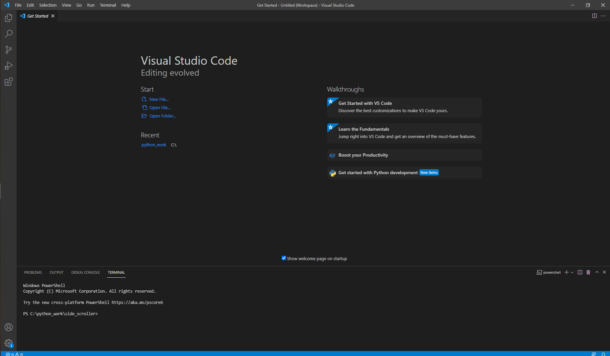
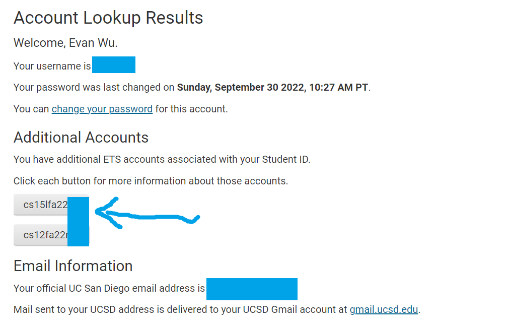
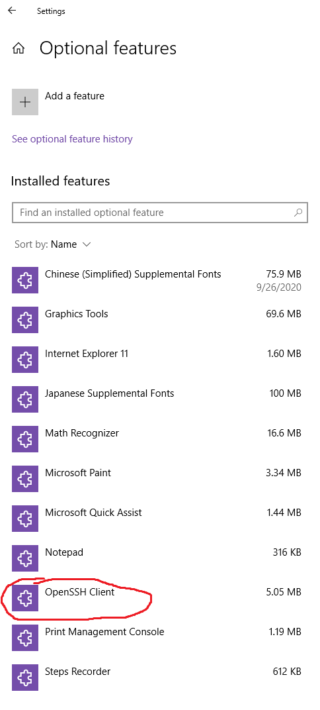
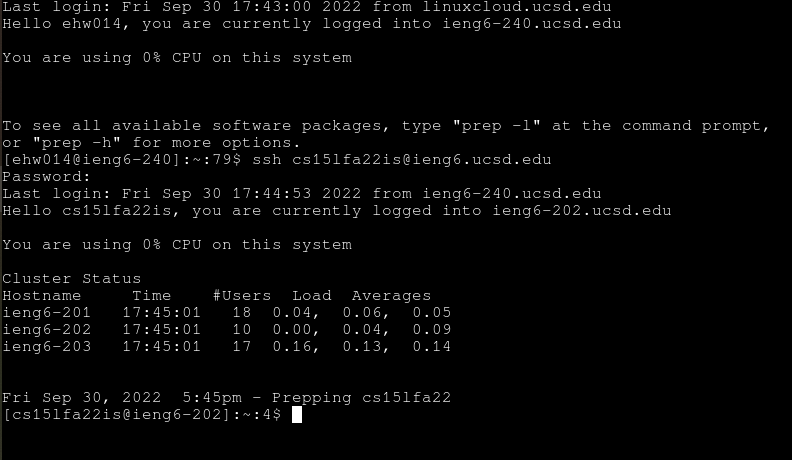
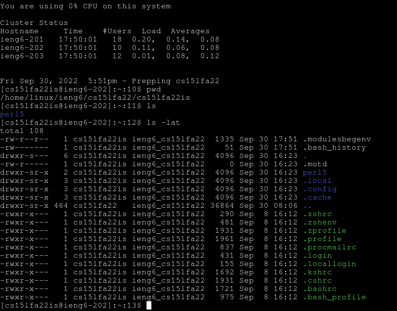
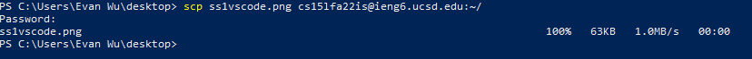
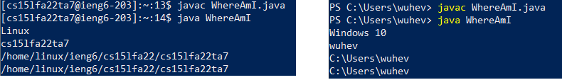
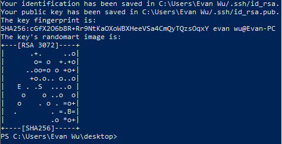

# **How To Setup for CS 15L**

**Installing VScode**

The first thing to do is to install VScode onto your computer. Go to [Link](https://code.visualstudio.com/), and click the download button for your OS.
Once you've installed it, open the program; you should open to a window that looks like this: 
VScode will be program we use to write and work with code, when we are not using the terminal.

**Find your CSE15L Account Resetting UCSD Password**

Before you can connect to your CSE15L account, you will need to find you account and you will most likely have to reset your password.

1) Find your CS15L account here: [Link](https://sdacs.ucsd.edu/~icc/index.php)

2) Insert your Username and Student ID in the section "Account Lookup" and click submit.

3) You should arrive at a page that looks like this: 

After this, you should click the button that starts with "cs15lfa22", then click the link "change your password" in the following page.

4) You should arrive at a page called "Global Password Change Request". If you don't know your current password, click on the link at the bottom of the page, whicch will e-mail you password reset, then come back to this step.
Type in your current password and your new passwords. 
Two things to note: First, **Do not click the "check password" button.** Once you are done, simple click on the bottommost text field, "confirm new password" and type the "Enter" key. Second, **Come up with a password that is at least 15 characters.** This is a tip I receieved from the IT Desk. Ignore the field that says 7-30 characters.

5) Wait 15 - 60 minutes. You can continue to the next step and try SSH using Terminal in Remotely Connecting, step 2 to verify if your password change was successful.

**Remotely Connecting**

There are couple steps to remotely connecting to your CSE15L account.

1) Install OpenSSH **DO ONLY IF ON WINDOWS**
* Go to Settings > Apps, then click "Optional Features"
* Search the list of installed features for "OpenSSH Client". If it isn't there, install it. 

2) SSH using Terminal
* In the Visual Studio terminal (you can also use Windows Powershell or MacOS terminal) , type in (with the 'zz' replaced with your student account info)

    `ssh cs15lfa22zz@ieng6.ucsd.edu` 
* Type in your password (don't be alarmed if there are no asterisks or anything)
* If you're prompted to continue connecting, type "yes".

After that, you should be in! It looks something like this 

(If yours looks a little different that's okay, I'm using UCSD Cloudlabs and not Visual Studio terminal)

**Trying Some Commands**

You can try some commands on both your remote session and computer to see the differences between the two. Some commands are:

`ls` - lists the files and folders in current directory

`cat` - prints out the contents of a specific file

`cd` - changes the directory

`exit` - ends the remote session

a more comprehensive list of terminal commands can be found here: [Link](https://mally.stanford.edu/~sr/computing/basic-unix.html)

**Moving Files with scp**

What is scp? SCP is a way to move a file from the host computer (your computer) to the remote computer. 

To demonstrate this, on **your client**, create a file called `WhereAmI.java` with the following code:

    class WhereAmI {
        public static void main(String[] args) {
            System.out.println(System.getProperty("os.name"));
            System.out.println(System.getProperty("user.name"));
            System.out.println(System.getProperty("user.home"));
            System.out.println(System.getProperty("user.dir"));
        }
    }

Use the commands:

`javac WhereAmI.java`

`java WhereAmI`

to compile and run it. This should print your computer's OS, your user name, and some file directories.

Now, type into your terminal:

`scp WhereAmI.java cs15lfa22zz@ieng6.ucsd.edu:~/`

enter your password when prompted. If successful, you should see something like this:

(ignore the filename)

You can test this by going back into your remote session, and using the javac and java commands to compile and run the program on the cs15l account. You'll see that you get different print statements than when you ran it on your personal computer. 

For me, the screenshot on the left shows my output when I ran it on the remote session (TA account), while the right screenshot is the output for my windows laptop.

**Setting an SSH Key**

One convenient thing we can do is create a ssh-keygen, which is a pair of files that exist on the client and remote desktop and they make it so you don't have to type in your password every time you want to `ssh` or `scp`.

On **your client**, type into terminal:

`ssh-keygen`

press enter for any further prompt until you see output similar to this:

This will have generated two files - `id_rsa` and `id_rsa.pub`. You need the public key, `id_rsa.pub` to be on the remote computer for the ssh key to work.

On your remote session, use the command `mkdir .ssh` . This will make a folder to store the public key.

Now on your client, use the following command:

`scp /Users/YOURNAME/.ssh/id_rsa.pub cs15lfa22@ieng6.ucsd.edu:~/.ssh/authorized_key`

This will move the public key to the other computer, and you will no long have to type your password everytime you want to ssh!

**Optimizing Remote Running**

I wasn't able to do most of this step due to password troubles in lab. About half my work on the lab is split between the CS15L TA's account and I only managed to SSH into my actual CS15L lab on Friday 9/30/2022 after submitting a ticket and working with the IT desk. 
